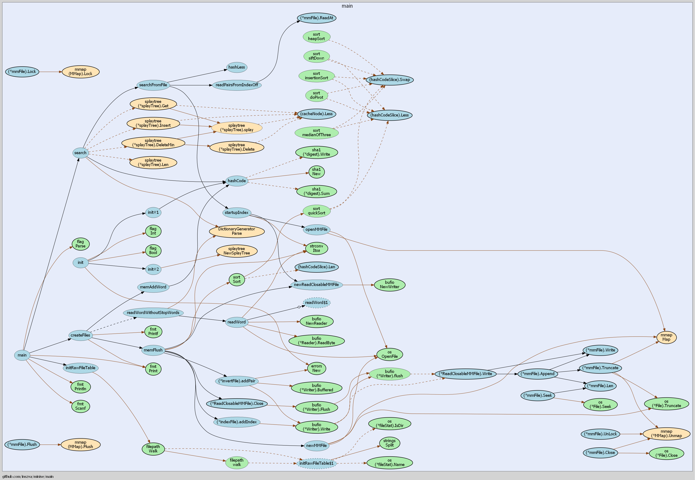

# MiniSE

## Structure

A **Spider** that can claw data from http://shakespeare.mit.edu/
A **DictionaryGenerator** that create a stop words dictionary
A **MiniSearchEngineer** that can create invert index and search from them

## Spider

### Design

Firstly, we can see the raw code of `http://shakespeare.mit.edu/`. We can find that all hyperlinks under
Comedy, History, and Tragedy href to a index.html where we can see a hyper link to full version of this
set. For example, when I click `All's Well That Ends Well` in the homepage, I will go to a index page of
`All's Well That Ends Well` with a hyperlink `Entire play in one page` href to `http://shakespeare.mit.edu/allswell/full.html`.

So I can peek all hyperlinks under Comedy, History and Tragedy using regexp ` <a href="(.*)/index.html">`.
Concat the submatch string with `/full.html` and the website path, we will get the target URL.

Secondly, the Poetry is a little different. Click `The Sonnets` will go to a index page that list many poetry
 pages whose link can be peeked by using regexp `<DT><A HREF="(.*)">` in the list page.

Finally, poetry except `The Sonnets` all can directly reach by using regexp `<em><a href="(.*)">` to peek their
 URL.

### Implement

By assessment, the target data is very small(<100MB) so I can easily put them all in memory. To avoid network
crash problems, I take proper reconnect operation in http client. To make best of multi-processor, I use multi-
threads to process network request and regexp running. It is worth a visit that I use **Atomic Integer** and
**Compare And Set** atomic operation to avoid Mutex to increase parallel performance. Additional buffered IO of
 disk file is necessary when frequent.

### Code Style

Standard Go code style but I like to use `goto`.

## Dictionary Generator

### Design

Dictionary Generator is designed to create a tire tree(dictionary tree) that mapping every english word to
another word or null. The mapping policy is below: if the word is a stop word, it will be mapped to null,
else it will be mapped to its stem.

### Reference

> Go-stem https://github.com/agonopol/go-stem

> stopwords.txt http://www.onjava.com/2003/01/15/examples/EnglishStopWords.txt

### Implement

By assessment, there is only 524 stop words. I can easily push them all in a tire tree in memory. Final output
interface is a function map word to word as `Design` says.

### Test

I did some unit test, and get 85% coverage.

## SearchEnginerr

### CreateIndex

The invert index include two parts index file and the invert file. The invert file is a sequence of <rawFId, rawFOff> pairs following
 a 8 bytes integer `length` that means the number of pairs. The sequence means the word appears in raw file `#rawFId`, at offset `#rawFOff`.
The index file is a sequence of <hashCode, invOff> pairs, which means the appear records of the word with the hashCode is at offset
`#invOff` of its corresponding invert file.

The invert files will be save to `./invert` with a number between 0-255 as name, e.g. `./invert/1.inv`. The number `n` represents
 that all words' hash in this index has a first byte `n`. For example, a word `TTT`'s hash code is `0x15 0x88 0x96 0x23`, it will
 be in index file `./index/21.inv` and invert file `./invert/21.inv`.

> By default, the program is working in one process, this is because it is designed to process big data. If a raw file is 4GB large,
its invert index can hardly be entirely put in main memory. If use multi-process in this case, the main memory will be lack and the
 operation system will continue swapping page in and out, which will loss performance. But if you only want to process some little
 files, you can run multiple processes of this program using its command line parameters.

### Search

A query word will be hashed and stop-words handled before search it from the index file. To improve the search speed, there's a cache
, implemented by Splay tree in main memory, which can contains 1024 word's result cache.

### Implement

The file IO is all buffered to reduce system call cost and using memory-mapped IO. Sequences of <hashCode, invOff> is from big to little.
 The search of index is cached and use binary search if not cached.

## Tests

Make many test cases in [search_test.go](./main/search_test.go), I test the search engine with some words and their location in the raw file,
 and get 85% coverage of `search.go`, which means it coverage almost every branches of the search module.

## Feature

This program can run in 4G RAM machine to create index of about **1,280,000,000,000** input words, and has a well performance for about
**512,000,000,000** input words.